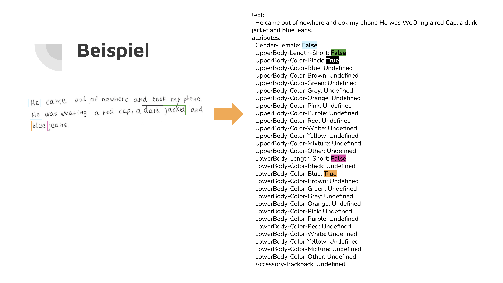
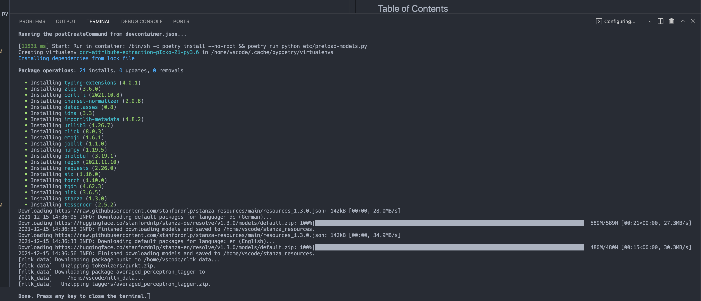
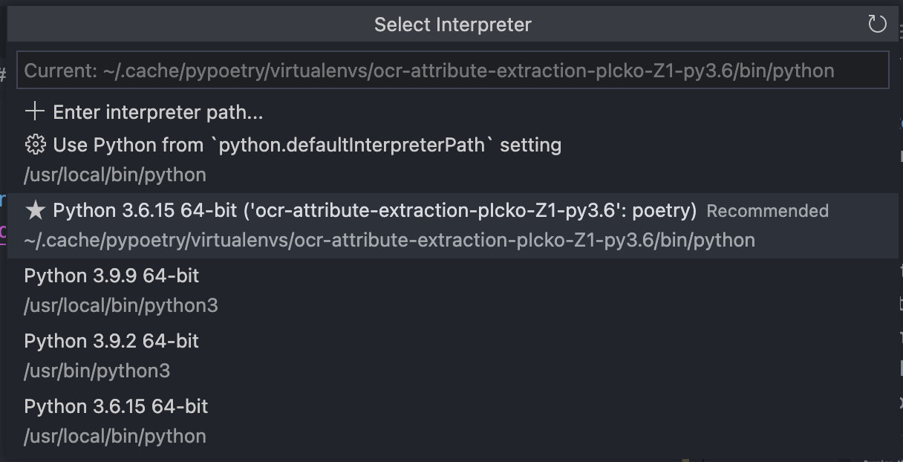

# IW276WS21P19 - OCR + Extraktion von Attributbasierte Personenbeschreibung

A tool to extract specific attributes from images containing person descriptions. Intended to run on the Jetson Nano.



> This work was done by David Hidalgo León, Jannik Höfler, Matthias Herzog during the IW276 Autonome Systeme Labor at the Karlsruhe University of Applied Sciences (Hochschule Karlruhe - Technik und Wirtschaft) in WS 2021 / 2022.

## Usage

### Requirements

- Jetson Nano
- Jetpack 4.5
- Docker
- Input files in JPEG or PNG format

### Usage Examples

```sh
# run complex extraction on a directory containing multiple english documents, print human readable results on stderr and save a json file with the results
docker run --rm --runtime nvidia -v /path/to/dataset:/data ghcr.io/iw276/iw276ws21-p19:master --skip-download-models --json /data/results.json /data

# run simple extraction
docker run --rm --runtime nvidia -v /path/to/dataset:/data ghcr.io/iw276/iw276ws21-p19:master --skip-download-models --extraction-method simple /data

# run on a single input file
docker run --rm --runtime nvidia -v /path/to/dataset:/data ghcr.io/iw276/iw276ws21-p19:master --skip-download-models /data/file.jpg
```

### CLI Reference

```
usage: oae [-h] [--language {en,de}] [--skip-download-models]
           [--extraction-method {complex,simple}] [--json PATH]
           PATH [PATH ...]

positional arguments:
  PATH

optional arguments:
  -h, --help            show this help message and exit
  --language {en,de}    the language of the input data. default: en
  --skip-download-models
                        don't download models on start
  --extraction-method {complex,simple}
                        choose the extraction method. default: complex
  --json PATH           output the extracted attributes at the specified path
```

## Development

### With VSCode Remote Containers

#### Requirements

- Visual Studio Code
- [Remote Containers Extension](https://marketplace.visualstudio.com/items?itemName=ms-vscode-remote.remote-containers)
- Docker
- Git

#### Setup

- Clone the project locally
- Open the project in VSCode
- Ctrl/Cmd + Shift + P -> Remote Containers: Reopen in Container
- After the container has been built VSCode will automatically download the project dependencies and download the necessary models: Wait until this step is finished
  
- Ctrl/Cmd + Shift + P -> Python: Select interpreter -> Choose the interpreter in `~/.cache/pypoetry/...`
  

### Locally

#### Requirements

- Git
- Python 3.6
- [Poetry](https://python-poetry.org/docs/#installation)
- pkg-config
- libtesseract >=3.04
- libleptonica >=1.71

#### Setup

```sh
# install dependencies
poetry install --no-root

# download models
poetry run python etc/preload-models.py

poetry run python -m ocr_attribute_extraction --help
```

## Acknowledgments

This repo is based on

- [tesserocr](https://github.com/sirfz/tesserocr)
- [Stanza](https://stanfordnlp.github.io/stanza/)

Thanks to the original authors for their work!

## Contact

Please email `mickael.cormier AT iosb.fraunhofer.de` for further questions.
